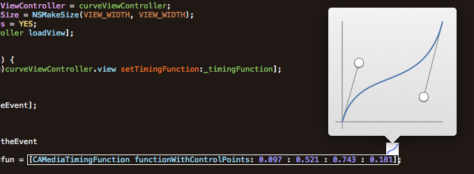

# CATweaker   

## Overview

A helper tool for creating beautiful CAMediaTimingFunction curve.

CATweaker come with an Xcode plugin:

# CATweakerSense for Xcode

## Overview

CATweakerSense is an Xcode plugin that makes working with `CAMediaTimingFunction` more visual.

You might use [ColorSense](https://github.com/omz/ColorSense-for-Xcode) before. It let you pick up a color right from Xcode caret.

CATweakerSense is like ColorSense, but it lets you pick a CAMediaTimingFunction curve. When you put the caret on one of your CAMediaTimingFunction, it automatically shows the actual time curve as an overlay, and you can even adjust it on-the-fly with the curve adjuster.

The plugin also adds some items to the _Edit_ menu to enable and to disable CATweakerSense temporarily. These menu items have no keyboard shortcuts by default, but you can set them via the system's keyboard preferences (Xcode's own preferences won't show them).

I'm [@lianxu](http://twitter.com/lianxu) on Twitter.

## Installation

Simply build the Xcode project and restart Xcode. The plugin will automatically be installed in `~/Library/Application Support/Developer/Shared/Xcode/Plug-ins`. To uninstall, just remove the plugin from there (and restart Xcode).

If you get a "Permission Denied" error while building, please see [this issue](https://github.com/omz/ColorSense-for-Xcode/issues/1).

This is tested on OS X 10.9.2 with Xcode 6.2.

## Limitations

* It only works for constant point value, something like `[CAMediaTimingFunction functionWithControlPoints: abc/def : 0.1 : 0.15 : 0.9];` won't work.

## Credits

This work is derived from the awesome [ColorSense](https://github.com/omz/ColorSense-for-Xcode) plugin of Ole Zorn([@olemoritz](http://twitter.com/olemoritz)). Thanks Ole!

## License

    CATweaker & CATweakerSense is published under MIT License

    Copyright (c) 2015 Xu Lian (@lianxu)

    Permission is hereby granted, free of charge, to any person obtaining a copy of
    this software and associated documentation files (the "Software"), to deal in
    the Software without restriction, including without limitation the rights to use,
    copy, modify, merge, publish, distribute, sublicense, and/or sell copies of the
    Software, and to permit persons to whom the Software is furnished to do so,
    subject to the following conditions:

    The above copyright notice and this permission notice shall be included in all
    copies or substantial portions of the Software.

    THE SOFTWARE IS PROVIDED "AS IS", WITHOUT WARRANTY OF ANY KIND, EXPRESS OR
    IMPLIED, INCLUDING BUT NOT LIMITED TO THE WARRANTIES OF MERCHANTABILITY, FITNESS
    FOR A PARTICULAR PURPOSE AND NONINFRINGEMENT. IN NO EVENT SHALL THE AUTHORS OR
    COPYRIGHT HOLDERS BE LIABLE FOR ANY CLAIM, DAMAGES OR OTHER LIABILITY, WHETHER
    IN AN ACTION OF CONTRACT, TORT OR OTHERWISE, ARISING FROM, OUT OF OR IN
    CONNECTION WITH THE SOFTWARE OR THE USE OR OTHER DEALINGS IN THE SOFTWARE.
